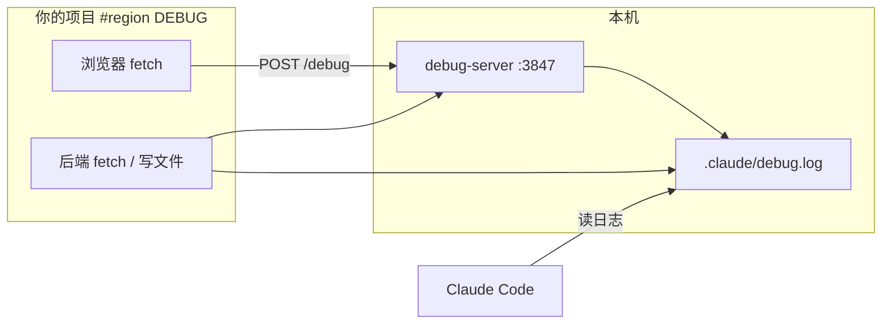

# debug-mode

在 **Claude Code** 里复刻 **Cursor Debug Mode** 的交互式调试流程：先列假设 → 在代码里插桩 → 你本地复现 → 读运行时日志验证 → 再修复，避免「凭感觉改代码」。

## 适用场景

- 接口返回正常但 UI / 状态不对
- 异步、竞态、闭包陈旧等难以从堆栈直接看出的问题
- 需要对比「某条代码路径有没有走到、变量当时是什么」

不太适合：明显的拼写错误、一眼能看懂的堆栈行号、改一行就能修好的 typo。

## 前置条件

- [Claude Code](https://code.claude.com/)（支持 Skills / 斜杠命令）
- 本机已安装 **Node.js**（用于跑日志收集服务，无额外 npm 依赖）

## 安装

任选一种方式，把本目录放到 Claude Code 的 skills 路径下即可：

```bash
# 全局：所有项目可用
cp -r skills/debug-mode ~/.claude/skills/debug-mode

# 仅当前仓库
mkdir -p .claude/skills
cp -r /path/to/corner-skills/skills/debug-mode .claude/skills/
```

安装后**重启 Claude Code**，在输入框输入 `/` 应能看到 **`debug-mode`**。

> Skill 配置了 `disable-model-invocation: true`：只有你用 `/debug-mode` 进入，Claude 不会自动开启，避免普通对话里误插桩。

## 快速开始

### 1. 进入 Debug Mode

在 Claude Code 中输入：

```text
/debug-mode 点击提交后列表不刷新，Network 里接口 200
```

也可以先 `/debug-mode`，再在后续消息里补充复现步骤。

### 2. 配合 Agent 完成一轮调试

Agent 会按阶段推进，**你需要在中间手动复现 bug**（和 Cursor 一样）：

| 阶段 | 你会看到什么 | 你需要做什么 |
|------|----------------|----------------|
| 理解 + 假设 | 列出 H1、H2… 可能原因 | 补充期望/实际行为、复现步骤（若没说清） |
| 插桩 | 代码里出现 `#region DEBUG` 块 | 按提示操作页面 / 调 API **复现一次** |
| 分析 | 根据 `.claude/debug.log` 给出诊断 | 回复「已复现」或粘贴现象 |
| 修复 + 验证 | 改业务代码，**暂时保留**插桩 | 再复现一次，确认问题消失 |
| 清理 | 删除所有 `#region DEBUG`、停掉日志服务 | 一般不用动手 |

### 3. 结束后

项目下可能产生（建议加入 `.gitignore`）：

```text
.claude/debug.log          # NDJSON 运行时日志
.claude/debug-server.pid  # 日志服务进程信息
.claude/debug-server.out   # 服务 stdout（可选）
```

---

## 工作原理

本 skill 会在本机启动一个轻量 HTTP 服务，把前端/后端的调试信息汇总到**同一个日志文件**，供 Claude 读取分析。



- **默认端口**：`3847`（环境变量 `DEBUG_SERVER_PORT` 可改）
- **日志路径**：`{项目根}/.claude/debug.log`
- **插桩约定**：必须用 `// #region DEBUG` … `// #endregion DEBUG` 包裹，修复后一次性删掉
- **不要用** `console.log` / `print` 做调试输出（会污染终端，且与 Cursor 规则不一致）

各语言插桩示例见：[references/instrumentation.md](./references/instrumentation.md)。

---

## 手动操作脚本（可选）

Agent 通常会代你执行；你也可以自己在项目根目录操作：

```bash
SKILL=~/.claude/skills/debug-mode/scripts   # 按实际安装路径修改
PROJECT=$(pwd)

# 启动日志服务
bash "$SKILL/start-server.sh" "$PROJECT" 3847

# 探活
curl http://127.0.0.1:3847/health

# 清空日志（每次复现前）
bash "$SKILL/clear-log.sh" "$PROJECT" 3847

# 停止服务
bash "$SKILL/stop-server.sh" "$PROJECT"
```

### 手动发一条测试日志

```bash
curl -X POST http://127.0.0.1:3847/debug \
  -H 'Content-Type: application/json' \
  -d '{"hypothesis":"H1","message":"smoke test","data":{"ok":true}}'

cat .claude/debug.log
```

### HTTP API

| 方法 | 路径 | 说明 |
|------|------|------|
| `GET` | `/health` | 检查服务是否正常、日志文件路径 |
| `POST` | `/debug` | 写入一条日志（JSON body） |
| `POST` | `/clear` | 清空日志文件 |

`POST /debug` 常用字段：

| 字段 | 说明 |
|------|------|
| `hypothesis` | 假设编号，如 `H1` 或 `1` |
| `message` | 简短描述 |
| `data` | 任意 JSON，记录变量快照 |
| `location` | 可选，如 `src/App.tsx:42` |

---

## 目录说明

```text
debug-mode/
├── README.md                 # 本文件（给人看）
├── SKILL.md                  # Agent 执行的完整流程（给 Claude 看）
├── scripts/
│   ├── debug-server.js       # 日志收集 API
│   ├── start-server.sh
│   ├── stop-server.sh
│   └── clear-log.sh
├── references/
│   └── instrumentation.md    # 前后端插桩代码片段
└── evals/
    └── evals.json            # skill 评测用例（可选）
```

---

## 常见问题

**Q：`/debug-mode` 找不到？**  
确认目录名为 `debug-mode`，且位于 `~/.claude/skills/` 或项目 `.claude/skills/` 下，然后重启 Claude Code。

**Q：浏览器插桩没有日志？**  
先 `curl http://127.0.0.1:3847/health` 确认服务在跑；确认插桩 URL 端口与启动时一致（默认 3847）。

**Q：日志文件在哪？**  
一般在项目根目录 `.claude/debug.log`。远程或只读环境可改用 `/tmp/.claude/debug.log`（需在插桩里写死绝对路径）。

**Q：和 Cursor IDE 内置 Debug Mode 的关系？**  
流程与规则对齐（假设 → 插桩 → 复现 → 读日志 → 修复 → 清理）；本 skill 通过**本地 HTTP + 统一日志文件**在 Claude Code 中实现同样协作方式。

**Q：调试完忘记停服务？**  
```bash
bash ~/.claude/skills/debug-mode/scripts/stop-server.sh "$(pwd)"
```

---

## 相关链接

- Claude Code Skills 文档：<https://code.claude.com/docs/en/skills>
- 更细的插桩示例：[references/instrumentation.md](./references/instrumentation.md)
