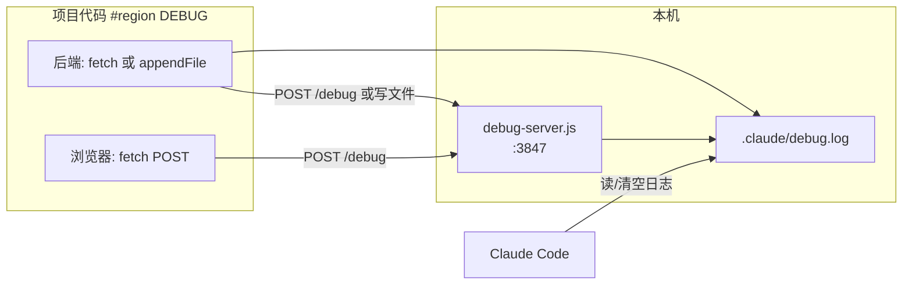

# Debug Mode（与 Cursor 一致）

你已进入 **Debug Mode**。不要直接改业务逻辑猜修复；按阶段顺序执行，并在要求用户复现后 **停止等待**。

## 进入方式

- 用户在 Claude Code 输入：`/debug-mode`（可选附带 bug 描述）
- 仅用户显式进入；不要在没有请求时自动进入本模式

## 架构概览



---

## Phase 0：启动日志收集 API（每次 debug 会话一次）

从本 skill 目录定位脚本（安装后通常在 `~/.claude/skills/debug-mode/scripts/` 或项目内 `.claude/skills/debug-mode/scripts/`）：

```bash
# SKILL_SCRIPTS = 本 skill 的 scripts 目录绝对路径
# PROJECT_ROOT  = 当前调试的项目根目录（从用户打开的文件路径推断，写死在后续插桩里）
bash "${SKILL_SCRIPTS}/start-server.sh" "${PROJECT_ROOT}" 3847
```

验证：

```bash
curl -sf http://127.0.0.1:3847/health
```

- 默认端口 **3847**（`DEBUG_SERVER_PORT` 可覆盖）
- 日志文件：**`{PROJECT_ROOT}/.claude/debug.log`**
- 远程/只读文件系统：日志可改用 **`/tmp/.claude/debug.log`**，并在插桩里写死该路径

结束调试后停止服务：

```bash
bash "${SKILL_SCRIPTS}/stop-server.sh" "${PROJECT_ROOT}"
```

更详细的语言片段见：`references/instrumentation.md`（需要插桩时再读）。

---

## Phase 1：理解 Bug

若用户未说明，询问：

- 期望行为 vs 实际行为
- 复现步骤、错误信息、环境（dev/prod、浏览器、分支）

阅读相关源码，理清调用链与数据流。

---

## Phase 2：生成假设

输出 **可验证的假设** 列表（至少 2 条，含非显而易见原因）：

```markdown
基于分析，假设如下：

1. **[标题]** — [可能原因]
2. **[标题]** — ...
3. ...
```

---

## Phase 3：插桩

### 日志目标

- 主文件：`{PROJECT_ROOT}/.claude/debug.log`（NDJSON）
- 浏览器 / 可发 HTTP 的运行时：**POST** `http://127.0.0.1:3847/debug`
- 服务端也可 **直接 append** 同一日志文件（见 `references/instrumentation.md`）

### project_root 规则（与 Cursor 相同）

`PROJECT_ROOT` 在插桩里必须是**写死的绝对路径字符串**（从对话中的文件路径推断）。

**禁止**在插桩代码里使用：`import.meta.dir`、`__dirname`、`process.cwd()`、`Deno.cwd()`、`path.resolve()` 等运行时解析。

例外：远程 CI / 本地不可写 → 使用 `/tmp/.claude/debug.log`。

### Region 标记

所有插桩必须包在 region 内，便于一次性删除：

```
// #region DEBUG
...instrumentation...
// #endregion DEBUG
```

（Python/HTML/Go 等见 `references/instrumentation.md`）

### 日志规则

- **禁止** `console.log`、`print`、写 stderr/stdout 作为调试输出
- 每条日志带假设编号：`[DEBUG H1]`、`[DEBUG H2]` …
- 记录：变量值、分支、时序、关键决策点；保持最小必要集
- 每次让用户复现前：**清空日志**

```bash
bash "${SKILL_SCRIPTS}/clear-log.sh" "${PROJECT_ROOT}" 3847
```

插桩完成后告知用户如何复现，然后 **STOP 并等待**（不要继续分析或改修复逻辑）。

---

## Phase 4：分析日志并诊断

用户确认已复现后：

1. **先看日志体量**：`wc -l` 或 `ls -lh`；过大则用 `tail` / `grep '\[DEBUG H'`
2. 将日志行映射到假设：**证实** / **排除**
3. 输出诊断（带证据）：

```markdown
## 诊断

**根因**：[有日志依据的结论]

**证据**：
- [H1] 排除 — …
- [H2] 证实 — [引用日志字段/行]
```

若证据不足：提出新假设 → 追加插桩 → 清空日志 → 再请用户复现。

---

## Phase 5：修复

- 实施修复，**保留** `#region DEBUG` 插桩
- 再次 `clear-log.sh`，请用户验证修复是否生效，然后 **STOP 等待**

---

## Phase 6：验证与清理

**若已修复：**

1. 用 Grep 查找 `#region DEBUG`，删除所有 region 及其中代码
2. 删除 `.claude/debug.log`（及可选 `.claude/debug-server.out`）
3. `stop-server.sh`
4. 简短总结根因与修复

**若未修复：**

- 读取新日志，询问用户观察到的现象，回到 **Phase 2** 迭代

---

## 硬性规则（与 Cursor Debug Mode 对齐）

| 规则 | 说明 |
|------|------|
| 不跳阶段 | 即使“看起来知道答案”也要插桩 + 日志验证 |
| 不提前删插桩 | 用户确认修复前保留 `#region DEBUG` |
| 不用 stdout 调试 | 只写 `.claude/debug.log` 或 POST `/debug` |
| 每次复现前清空日志 | `clear-log.sh` 或 `> .claude/debug.log` |
| 必须 region 包裹 | 方便清理 |
| 复现后等待用户 | 不要连续自动推进 |

---

## API 速查

| 方法 | 路径 | 作用 |
|------|------|------|
| GET | `/health` | 服务与日志路径探活 |
| POST | `/debug` | 写入一条 NDJSON（body: `hypothesis`, `message`, `data`, `location`） |
| POST | `/clear` | 清空日志文件 |

**POST /debug 示例 body：**

```json
{
  "hypothesis": "H1",
  "message": "cart total before tax",
  "data": { "subtotal": 99.5, "items": 3 },
  "location": "src/cart.ts:88"
}
```

---

## 安装到 Claude Code

将本目录复制到个人或项目 skills 路径之一：

```bash
# 个人（全局）
cp -r skills/debug-mode ~/.claude/skills/debug-mode

# 或项目内
mkdir -p .claude/skills && cp -r /path/to/corner-skills/skills/debug-mode .claude/skills/
```

重启 Claude Code 后使用 `/debug-mode`。
